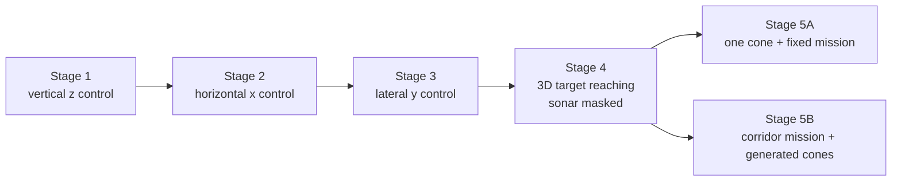
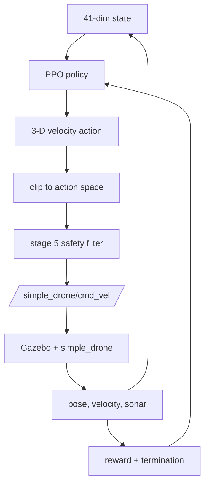
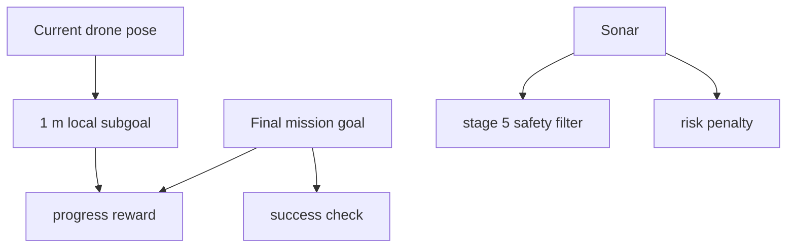

# RL Design: Part X Final Sonar Curriculum

This document describes the final environment used in
`HW2_Work/partX_final/drone_env.py`.

The task is still **Task D: autonomous obstacle avoidance using sonar**, but
the curriculum in `partX_final` is the cleaned-up final fork. It keeps one
fixed PPO interface across all stages so earlier checkpoints can continue into
harder stages.

## Curriculum Overview



The curriculum in `drone_env.py` is:

| Stage | Variant | Goal | Target setup | Sonar |
| --- | --- | --- | --- | --- |
| 1A | fixed | learn stable vertical motion | fixed `(0, 0, 1.0)` | masked |
| 1B | random | generalize vertical motion | `z in [0.8, 1.5]` | masked |
| 2A | fixed | learn forward/backward x motion | fixed `(1.0, 0, 1.0)` | masked |
| 2B | random | generalize x motion | `x in [-1.0, 1.5]` | masked |
| 3A | fixed | learn lateral y motion | fixed `(0, 1.0, 1.0)` | masked |
| 3B | random | generalize lateral motion | `y in [-1.0, 1.0]` | masked |
| 4A | random | single 3D waypoint | random `x,y,z` | masked |
| 4B | sequence | three 3D waypoints | three random `x,y,z` targets | masked |
| 5A | fixed obstacle mission | final mission with one cone | mission goal `(10, 0, 1)` | active |
| 5B | corridor obstacle mission | long corridor with several cones | mission goal `x = 10`, `y in [-3, 3]` | active |

## MDP Shape



The environment is a standard Gymnasium MDP:

- **State**: pose, velocity, target geometry, sonar ranges, sonar trends, and
  progress signals.
- **Action**: continuous linear velocity command in world axes.
- **Reward**: progress toward the active target, precision shaping, obstacle
  risk penalties, and terminal bonuses/penalties.
- **Transition**: the action is held for `step_dt` seconds, then the next ROS
  state is read back from Gazebo.

## ROS Interface

The policy publishes to:

```text
/simple_drone/cmd_vel
```

The bridge reads:

```text
/simple_drone/gt_pose
/simple_drone/gt_vel
/simple_drone/sonar/out
/simple_drone/front_sonar_left/out
/simple_drone/front_sonar_center/out
/simple_drone/front_sonar_right/out
/simple_drone/front_sonar_up/out
/simple_drone/front_sonar_down/out
/simple_drone/side_sonar_left/out
/simple_drone/side_sonar_right/out
```

Each reset uses `/reset_world` when available, then publishes `/reset`, lands
briefly, and publishes `/takeoff` until the drone reaches the takeoff altitude.

## State Space

The environment uses a fixed 41-dimensional state vector:

```text
12 navigation fields
7 current sonar ranges
7 sonar risk values
7 previous sonar ranges
7 sonar trend values
1 sonar-enabled flag
```

The declared Gym box is:

```text
low  = [-3.0, ..., -3.0]
high = [ 3.0, ...,  3.0]
shape = (41,)
dtype = float32
```

The bounds are a broad safety envelope. Most features are normalized into much
smaller ranges.

### Navigation Block

The first 12 values are:

| Slot | Field | Formula | Meaning |
| --- | --- | --- | --- |
| 1 | `x` | `pose[0] / xy_limit` | normalized world x position |
| 2 | `y` | `pose[1] / xy_limit` | normalized world y position |
| 3 | `z` | `pose[2] / max_altitude` | normalized altitude |
| 4 | `vx` | `velocity[0]` | world x velocity |
| 5 | `vy` | `velocity[1]` | world y velocity |
| 6 | `vz` | `velocity[2] / 0.5` | normalized vertical velocity |
| 7 | `dx` | `delta[0] / dx_norm` | x error to the active target |
| 8 | `dy` | `delta[1] / dy_norm` | y error to the active target |
| 9 | `dz` | `delta[2] / 1.5` | z error to the active target |
| 10 | `distance` | `distance / distance_norm` | full Euclidean distance to the active target |
| 11 | `target_progress` | see below | progress along the current stage |
| 12 | `total_targets` | `len(targets) / 3.0` | sequence-length hint |

The raw scale constants used by these formulas are:

| Constant | Value | Where it applies |
| --- | --- | --- |
| `xy_limit` | `8.0` in Stage 1-4, `12.0` in Stage 5 | normalizes `x` and `y` |
| `max_altitude` | `5.0` | normalizes `z` |

The normalization constants change by stage:

| Stage range | `dx_norm` | `dy_norm` | `distance_norm` |
| --- | --- | --- | --- |
| Stage 1-4 | 3.0 | 3.0 | 4.0 |
| Stage 5 | 10.0 | 5.0 | 12.0 |

Stage 5 needs larger normalization because the mission goal is much farther
away than the short curriculum stages.

### Sonar Block

The seven sonar sectors are always stored in this order:

```text
front_left, front_center, front_right, front_up, front_down, side_left, side_right
```

The four sonar blocks use the same sector order, but each block carries a
different kind of information:

| Block | What it means | How to read it |
| --- | --- | --- |
| current sonar ranges | the latest measured distance in each sector | smaller means an obstacle or surface is closer right now |
| sonar risk values | a compressed danger score derived from the current ranges | `0` means safe/far, values near `1` mean very close or risky |
| previous sonar ranges | the same distances from the previous step | lets the policy remember what the world looked like one action ago |
| sonar trend values | how the normalized ranges changed from the previous step to the current one | positive means the obstacle is getting closer, negative means it is moving away |

The current and previous range values come from `Range` messages and are
sanitized by `_safe_sonar` before entering the state vector. Missing or invalid
readings fall back to the maximum safe range, so the policy sees "nothing
nearby" instead of NaN.

In practice, these four blocks work together like this:

- current ranges tell the drone what is nearby now
- risk values turn that geometry into a simple danger signal
- previous ranges give the policy a one-step memory
- trend values tell the policy whether the situation is tightening or opening

That combination is more useful than any single sonar view on its own.

### Sonar Masking

Sonar exists from Stage 1, but it is masked until Stage 5:

```text
sonar ranges   = 1.0
sonar risks    = 0.0
sonar trends   = 0.0
sonar_enabled  = 0.0
```

This keeps the state shape fixed while preventing early stages from
learning from irrelevant obstacle signals.

Here, `1.0` means the normalized maximum sonar range, not "1 meter".
With `max_sonar_range = 10.0`, a normalized value of `1.0` means the beam is
at the farthest safe reading, so the masked channels look like "nothing nearby".
The ROS sonar bridge defaults are `sonar_min_range = 0.02` and
`sonar_max_range = 10.0`.

When sonar is active in Stage 5:

```text
sonar ranges   = real ROS Range readings, clipped to the valid range
sonar risks    = bounded proximity risk
sonar trends   = previous normalized range - current normalized range
sonar_enabled  = 1.0
```

The risk mapping is:

```text
risk = clip((sonar_caution_distance - range) / sonar_caution_distance, 0, 1)
```

with `sonar_caution_distance = 1.5`.

The trend is positive when the obstacle is getting closer.

### Stage 5 Target Progress

In Stages 1-4, `target_progress` is waypoint progress:

```text
target_index / max(total_targets - 1, 1)
```

For example, in Stage 4B there are 3 waypoints, so:

```text
first target active:  0 / 2 = 0.0
second target active: 1 / 2 = 0.5
third target active:  2 / 2 = 1.0
```

Only Stage 4B uses this multi-waypoint progress inside Stages 1-4.
Stages 1A, 1B, 2A, 2B, 3A, 3B, and 4A each have only one target, so
`target_progress` stays `0.0` for the whole episode.

In Stage 5, the active target is a moving local subgoal, so
`target_progress` switches to mission-course progress:

```text
clip((mission_distance_start - mission_distance_for_progress) / mission_distance_start, 0, 1)
```

Here:

- `mission_distance_start` is the distance from the start pose to the final mission goal at reset
- `mission_distance_for_progress` is the current distance from the drone to that final mission goal
- `clip(..., 0, 1)` keeps the value inside the range `0.0` to `1.0`

Example:

- `mission_distance_start = 10`
- `mission_distance_for_progress = 7`

```text
(10 - 7) / 10 = 3 / 10 = 0.3
```

So `target_progress = 0.3`, which means the drone has completed 30% of the
mission distance.

This makes the progress signal meaningful for the long obstacle mission.

### Observation Safety Notes

- Missing sonar is treated as "no obstacle seen" instead of NaN.
- The reset logic waits for a valid pose before starting the episode.
- If the final state contains non-finite values, the episode terminates
  as `invalid_sensor`.

## Action Space

The policy outputs a 3-D continuous velocity command:

```text
[vx_cmd, vy_cmd, vz_cmd]
```

The bounds are:

```text
vx_cmd in [-1.0, 1.0]
vy_cmd in [-1.0, 1.0]
vz_cmd in [-0.5, 0.5]
```

The action is interpreted as a desired linear velocity in Gazebo/world axes.
No angular command is used in this homework. Vertical motion is intentionally
smaller because the drone is more sensitive in `z`.

The runtime sequence is:

1. PPO emits a raw action.
2. The action is clipped to the box bounds.
3. Stage 5 applies a sonar safety filter.
4. The filtered action is published to `/cmd_vel`.
5. The environment holds that action for `step_dt` seconds.

### Safety Filter

The safety filter only runs when sonar is active. It is a guardrail, not the
main obstacle-avoidance mechanism.

| Condition | Filtered effect |
| --- | --- |
| front sonar fan minimum `< 0.45` | clamp `vx <= 0.0` and force `vz >= 0.1` |
| side sonar left `< 0.45` | push `vy <= -0.2` |
| side sonar right `< 0.45` | push `vy >= 0.2` |

The filter outcome is logged as `action_was_filtered`. When the filter
intervenes, the reward is also reduced by `0.25`.

## Reward Function

The reward is dense and additive. A compact view is:

```text
reward =
  target progress
  + stage 5 mission progress
  + axis progress
  - distance penalty
  - stage precision penalty
  - near-target velocity penalty
  - near-target motion penalty
  - action magnitude penalty
  - action smoothness penalty
  - sonar risk penalty
  - safety-filter penalty
  + success bonus
  - terminal penalties
```

Here, "terminal" means an episode-ending state in RL. When the drone reaches a
terminal state, the current episode stops and no more future reward comes from
that run. In this environment, the terminal logic is the set of checks in
`step()` that decide whether to set `terminated = True` or `truncated = True`.

### 1. Active Target Progress

The main progress term is:

```text
scale * (previous_distance - distance)
```

with:

```text
scale = 10.0   if distance >= 0.5
scale = 4.0    if distance < 0.5
```

This rewards the drone when the active target gets closer and softens the gain
near the target so the policy does not learn to overshoot just to collect
progress.

### 2. Stage 5 Mission Progress

Stage 5 uses a moving local target, so the reward also tracks the far mission
goal:

```text
8.0 * (previous_final_distance - mission_goal_distance)
```

This keeps the policy moving toward the true mission goal instead of hovering
around local subgoals.

### 3. Axis-Specific Progress Reward

The environment tracks absolute error on each axis:

```text
[abs(dx), abs(dy), abs(dz)]
```

It then rewards improvement with stage-specific weights:

| Focus | Weight vector for `delta = previous_abs_error - current_abs_error` |
| --- | --- |
| vertical | `[2.0, 2.0, 12.0]` |
| horizontal | `[12.0, 3.0, 6.0]` |
| lateral | `[3.0, 12.0, 6.0]` |
| combined | `[7.0, 7.0, 7.0]` |

This is how the curriculum stays focused:

- Stage 1 cares most about `z`
- Stage 2 cares most about `x`
- Stage 3 cares most about `y`
- Stage 4 and Stage 5 care about balanced 3-D progress

### 4. Precision Penalty

The environment subtracts a stage-specific precision penalty based on the
current absolute axis errors:

| Focus | Precision penalty |
| --- | --- |
| vertical | `0.45*x_error + 0.45*y_error + 0.65*z_error` |
| horizontal | `0.45*x_error + 0.20*y_error + 0.45*z_error` |
| lateral | `0.20*x_error + 0.45*y_error + 0.45*z_error` |
| combined | `0.35*x_error + 0.35*y_error + 0.35*z_error` |

The focused axis gets the strongest pressure. The non-focused axes still
matter, so the drone cannot learn a very sloppy shortcut.

### 5. Distance and Near-Target Shaping

There is a small global distance penalty:

```text
-0.05 * distance
```

When the drone is close to the target, extra shaping is added:

```text
if distance < 0.6:
  -0.18 * velocity_norm
  -near_target_action_penalty * ||filtered_action||
```

The `near_target_action_penalty` is configurable, and in the final fork it is
set by the training script.

When the drone is even closer:

```text
if distance < 0.45:
  near-target motion penalty
```

That penalty splits the velocity into:

- radial speed toward/away from the target
- tangential speed around the target

The extra penalty is:

```text
0.18 * tangential_speed + 0.10 * total_speed
```

and if the drone is moving away from the target strongly enough
(`radial_speed < -0.03`), it adds:

```text
0.25 * abs(radial_speed)
```

This is what discourages orbiting and fly-through behavior near the goal.

### 6. Action Penalties

Two generic action penalties are always active:

```text
- action_penalty * ||filtered_action||
- action_smoothness_penalty * ||filtered_action - previous_action||
```

These keep the policy from using huge commands or jerky command changes.

If the action is filtered by the safety guardrail, the reward is reduced by:

```text
-0.25
```

### 7. Obstacle Risk Penalties

When sonar is active, the reward subtracts:

```text
-2.0 * obstacle_mean_risk**2
-4.0 * obstacle_max_risk**2
```

`obstacle_mean_risk` discourages staying in crowded space. `obstacle_max_risk`
reacts strongly to the closest detected obstacle.

Stage 5 adds one more caution term:

```text
if obstacle_max_risk > 0.2 and abs(vx) < 0.05:
  -0.2
```

This helps reduce the "freeze in front of the obstacle" pattern.

### 8. Terminal Logic

Terminal checks are ordered from safety failures to success:

| Status | Reward | Effect |
| --- | --- | --- |
| `invalid_sensor` | `-100` | terminate |
| `crash` | `-100` | terminate when `z < 0.25` |
| `out_of_bounds` | `-80` | terminate when `|x|` or `|y|` exceeds the XY limit |
| `unsafe_sonar` | `-100` | terminate when the closest sonar reading drops below `0.25` |
| `success` | `+80` | terminate after the final target is reached safely |
| `target_reached` | `+80`, plus `+30` if more targets remain | continue to the next waypoint |
| `timeout` | `-5 - 20 * min(distance, 2.0)` | truncate the episode |

If the drone enters the target radius but is still moving too fast in Stage 4
or later, it gets:

```text
-0.5 * velocity_norm
```

This prevents a fast fly-through from looking like a clean stop.

### Stage 5 Success Rule

Stage 5 does not use the moving local subgoal for success. It checks the final
mission goal instead:

```text
distance(mission_goal, pose) < success_distance
and velocity_norm <= stable_success_velocity
```

The final fork uses:

```text
stable_success_velocity = 0.35
stable_success_required = 1
```

So Stage 5 success means the drone reaches the real mission goal and is moving
slowly enough.

## Stage 5 Special Behavior

Stage 5 is the long-range obstacle mission.

### Local Subgoal

The active target is not the final goal. Instead, `_stage5_local_target()`
moves a local point one meter along the line from the drone to the mission
goal.



The visible target marker still marks the final mission goal. The local target
is only an internal reward and state helper.

### Stage 5A

Stage 5A uses:

- final mission goal: `(10.0, 0.0, 1.0)`
- one cone placed halfway between the takeoff position and the mission goal
- active sonar

This is the cleanest presentation-friendly final task in the current logs.

### Stage 5B

Stage 5B is the corridor version:

- final mission goal: `x = 10.0`, `y in [-3, 3]`, `z = 1.0`
- intended obstacle count: `2-10`
- intended obstacle positions: `x in [2, 8]`, `y in [-2, 2]`, `z = 0.05`
- intended spacing rules:
  - stay away from the start
  - stay away from the goal
  - keep a minimum gap between cones

The helper functions for sampling and spawning those cones exist in the code.
One important implementation note: the current `_update_stage_obstacle()`
branch in the checked-in `partX_final` file clears the generated obstacle and
leaves the Stage 5B spawn call commented out. So the code contains the Stage 5B
corridor logic, but the currently committed branch does not actually spawn the
sampled cones there.

## Current Result Snapshot

The latest saved evaluations in `partX_final` show:

| Stage | Latest saved result | Notes |
| --- | --- | --- |
| 5A | 10/10 success | cleanest final demo case |
| 5B | 3/10 success | still unstable in the corridor setting |

`partX_final` is the best overall fork in the repo, but Stage 5B is still the
rough edge. If I had to show one final result, Stage 5A is the safer demo.

## Why This Design Works for the Homework

- The state shape stays fixed across all stages.
- The action interface never changes.
- Sonar is masked until the obstacle stages.
- Stage 1-3 build single-axis control skills before the full 3D task.
- Stage 4 introduces 3D navigation without obstacle pressure.
- Stage 5 adds sonar and obstacle avoidance on top of the same interface.

That makes the curriculum easy to reuse, easy to continue training from, and
easier to explain in the final report.
