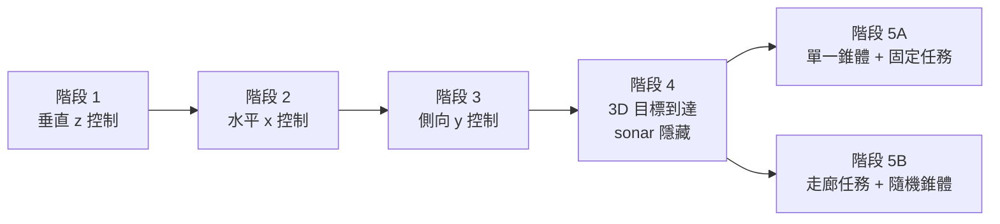
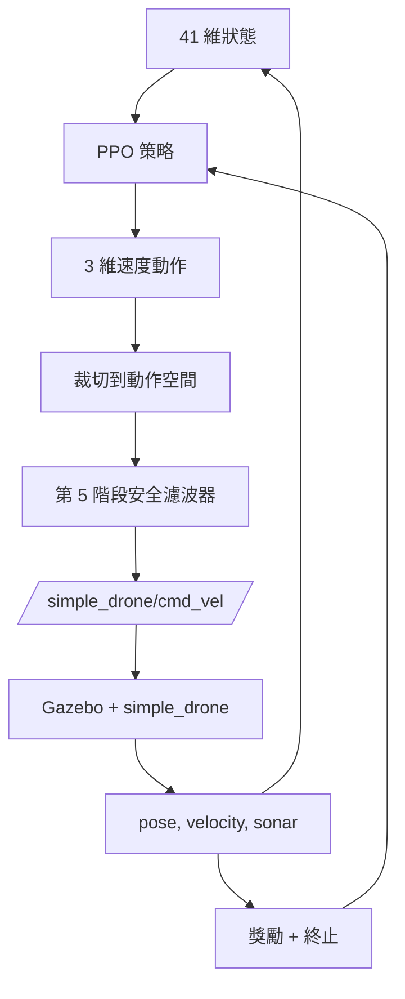
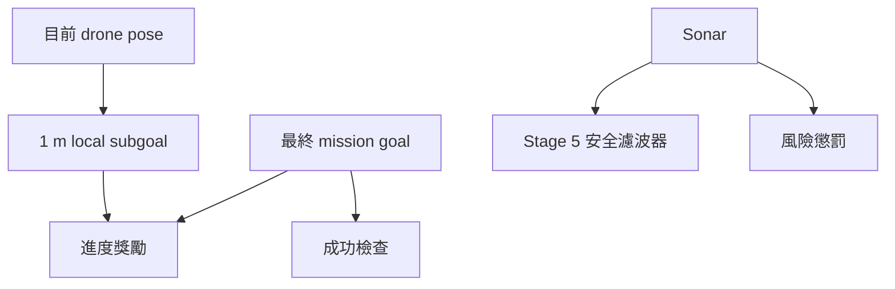

# 強化學習設計：Part X Final 感測器課程

這份文件說明 `HW2_Work/partX_final/drone_env.py` 使用的最終環境設計。

任務仍然是 **Task D：使用 sonar 做自主避障**。`partX_final` 是最後整理過的版本，
保留一套固定的 PPO 介面，讓前面較容易的 checkpoint 可以一路延續到更難的階段。

## 課程總覽



`drone_env.py` 裡的課程如下：

| 階段 | 變體 | 目標 | 目標設定 | Sonar |
| --- | --- | --- | --- | --- |
| 1A | 固定 | 學會穩定垂直移動 | 固定 `(0, 0, 1.0)` | 隱藏 |
| 1B | 隨機 | 泛化垂直移動 | `z in [0.8, 1.5]` | 隱藏 |
| 2A | 固定 | 學會前後 x 移動 | 固定 `(1.0, 0, 1.0)` | 隱藏 |
| 2B | 隨機 | 泛化 x 移動 | `x in [-1.0, 1.5]` | 隱藏 |
| 3A | 固定 | 學會側向 y 移動 | 固定 `(0, 1.0, 1.0)` | 隱藏 |
| 3B | 隨機 | 泛化側向移動 | `y in [-1.0, 1.0]` | 隱藏 |
| 4A | 隨機 | 單一 3D 航點 | 隨機 `x,y,z` | 隱藏 |
| 4B | 序列 | 三個 3D 航點 | 三個隨機 `x,y,z` 目標 | 隱藏 |
| 5A | 固定障礙任務 | 最終任務加一個錐體 | 任務目標 `(10, 0, 1)` | 啟用 |
| 5B | 走廊障礙任務 | 長走廊中放多個錐體 | 任務目標 `x = 10`, `y in [-3, 3]` | 啟用 |

## MDP 形狀



這個環境是一個標準的 Gymnasium MDP：

- **狀態**：位置、速度、目標幾何、sonar ranges、sonar trends，以及進度訊號。
- **動作**：在世界座標軸上的連續線速度指令。
- **獎勵**：朝目標前進的進度、精度 shaping、障礙風險懲罰，以及終止時的獎懲。
- **轉移**：動作會被維持 `step_dt` 秒，之後再從 Gazebo 讀回下一個 ROS 狀態。

## ROS 介面

策略會發布到：

```text
/simple_drone/cmd_vel
```

橋接程式會讀取：

```text
/simple_drone/gt_pose
/simple_drone/gt_vel
/simple_drone/sonar/out
/simple_drone/front_sonar_left/out
/simple_drone/front_sonar_center/out
/simple_drone/front_sonar_right/out
/simple_drone/front_sonar_up/out
/simple_drone/front_sonar_down/out
/simple_drone/side_sonar_left/out
/simple_drone/side_sonar_right/out
```

每次 reset 時，如果 `/reset_world` 可用就先呼叫它，接著送 `/reset`、短暫落地，
再持續送 `/takeoff`，直到 drone 到達起飛高度。

## 狀態空間

環境使用固定 41 維的狀態向量：

```text
12 個導航欄位
7 個目前 sonar ranges
7 個 sonar risk values
7 個前一次 sonar ranges
7 個 sonar trend values
1 個 sonar-enabled flag
```

Gym 的宣告 box 如下：

```text
low  = [-3.0, ..., -3.0]
high = [ 3.0, ...,  3.0]
shape = (41,)
dtype = float32
```

這些上下界只是寬鬆的安全包絡。實際上大部分欄位都會再正規化到更小的範圍。

### 導航區塊

前 12 個值的順序如下：

| 位置 | 欄位 | 公式 | 意義 |
| --- | --- | --- | --- |
| 1 | `x` | `pose[0] / xy_limit` | 正規化後的世界座標 x 位置 |
| 2 | `y` | `pose[1] / xy_limit` | 正規化後的世界座標 y 位置 |
| 3 | `z` | `pose[2] / max_altitude` | 正規化後的高度 |
| 4 | `vx` | `velocity[0]` | 世界座標 x 速度 |
| 5 | `vy` | `velocity[1]` | 世界座標 y 速度 |
| 6 | `vz` | `velocity[2] / 0.5` | 正規化後的垂直速度 |
| 7 | `dx` | `delta[0] / dx_norm` | 到目前 active target 的 x 誤差 |
| 8 | `dy` | `delta[1] / dy_norm` | 到目前 active target 的 y 誤差 |
| 9 | `dz` | `delta[2] / 1.5` | 到目前 active target 的 z 誤差 |
| 10 | `distance` | `distance / distance_norm` | 到目前 active target 的歐式距離 |
| 11 | `target_progress` | 見下方 | 目前階段的進度 |
| 12 | `total_targets` | `len(targets) / 3.0` | 序列長度提示 |

這些公式使用的原始尺度常數如下：

| 常數 | 數值 | 適用範圍 |
| --- | --- | --- |
| `xy_limit` | Stage 1-4 為 `8.0`，Stage 5 為 `12.0` | 用來正規化 `x` 和 `y` |
| `max_altitude` | `5.0` | 用來正規化 `z` |

不同階段的正規化常數如下：

| 階段範圍 | `dx_norm` | `dy_norm` | `distance_norm` |
| --- | --- | --- | --- |
| Stage 1-4 | 3.0 | 3.0 | 4.0 |
| Stage 5 | 10.0 | 5.0 | 12.0 |

Stage 5 的 mission goal 比前面短距離課程遠很多，所以需要更大的正規化尺度。

### Sonar 區塊

七個 sonar sector 的順序固定如下：

```text
front_left, front_center, front_right, front_up, front_down, side_left, side_right
```

四組 sonar 區塊都使用相同順序，但每一組代表的資訊不同：

| 區塊 | 意義 | 如何理解 |
| --- | --- | --- |
| current sonar ranges | 每個方向目前量到的距離 | 數值越小，代表障礙物或牆面離 drone 越近 |
| sonar risk values | 由 current ranges 壓縮出的危險分數 | `0` 代表安全或很遠，越接近 `1` 代表越危險 |
| previous sonar ranges | 前一步量到的距離 | 讓策略保留一步記憶，知道上一個 action 前世界長什麼樣子 |
| sonar trend values | 目前與前一步 normalized range 的變化量 | 正值代表障礙物更靠近，負值代表障礙物遠離 |

這些 range 值都來自 `Range` 訊息，進入 state vector 之前會先經過 `_safe_sonar` 清理。
如果讀值缺失或不合法，系統會回退到最大安全距離，讓策略看到的是「附近沒有障礙物」，而不是 NaN。

實際上，這四組資訊是一起看的：

- current ranges 告訴 drone 現在附近有什麼
- risk values 把幾何距離壓縮成簡單的危險訊號
- previous ranges 提供一步記憶
- trend values 告訴策略空間是在變窄還是變寬

這樣的組合比單看一組 sonar 資訊更有用。

### Sonar 遮罩

sonar 從 Stage 1 就存在，但直到 Stage 5 才真正啟用：

```text
sonar ranges   = 1.0
sonar risks    = 0.0
sonar trends   = 0.0
sonar_enabled  = 0.0
```

這樣可以固定 state shape，同時避免早期階段學到無關的障礙訊號。

這裡的 `1.0` 代表的是正規化後的最大 sonar 距離，不是「1 公尺」。
因為 `max_sonar_range = 10.0`，所以 `1.0` 表示該方向已經在最遠的安全讀值，
也就是 masked 後讓模型看到「附近沒有障礙物」。
ROS sonar bridge 的預設範圍是 `sonar_min_range = 0.02` 和
`sonar_max_range = 10.0`。

當 Stage 5 啟用 sonar 時：

```text
sonar ranges   = 真實 ROS Range 讀值，並裁到合法範圍
sonar risks    = 有界的接近風險
sonar trends   = 前一次正規化 range - 目前正規化 range
sonar_enabled  = 1.0
```

風險映射為：

```text
risk = clip((sonar_caution_distance - range) / sonar_caution_distance, 0, 1)
```

其中 `sonar_caution_distance = 1.5`。

trend 為正時，代表障礙物正在靠近。

### Stage 5 的目標進度

Stage 1-4 的 `target_progress` 是航點進度：

```text
target_index / max(total_targets - 1, 1)
```

例如在 Stage 4B 中有 3 個 waypoint，所以：

```text
第一個目標啟用時：0 / 2 = 0.0
第二個目標啟用時：1 / 2 = 0.5
第三個目標啟用時：2 / 2 = 1.0
```

在 Stage 1-4 裡，只有 Stage 4B 會出現這種多航點進度。
Stage 1A、1B、2A、2B、3A、3B 和 4A 都只有一個 target，所以整個 episode 內
`target_progress` 都會維持在 `0.0`。

Stage 5 的 active target 是一個會移動的 local subgoal，所以 `target_progress`
會改成 mission-course 進度：

```text
clip((mission_distance_start - mission_distance_for_progress) / mission_distance_start, 0, 1)
```

這裡：

- `mission_distance_start` 是 reset 時，起點到最後 mission goal 的距離
- `mission_distance_for_progress` 是目前 drone 到最後 mission goal 的距離
- `clip(..., 0, 1)` 會把數值限制在 `0.0` 到 `1.0` 之間

例子：

- `mission_distance_start = 10`
- `mission_distance_for_progress = 7`

```text
(10 - 7) / 10 = 3 / 10 = 0.3
```

所以 `target_progress = 0.3`，表示 drone 已經完成了 30% 的 mission 距離。

這樣進度訊號才對長距離避障任務有意義。

### 狀態安全說明

- 缺失的 sonar 會被當成「沒有看到障礙物」，而不是 NaN。
- reset 會等到有效 pose 出現後才開始 episode。
- 如果最後的 state 出現非有限值，episode 會以 `invalid_sensor` 結束。

## 動作空間

策略輸出一個 3 維連續速度指令：

```text
[vx_cmd, vy_cmd, vz_cmd]
```

其範圍為：

```text
vx_cmd in [-1.0, 1.0]
vy_cmd in [-1.0, 1.0]
vz_cmd in [-0.5, 0.5]
```

這個動作會被解讀成 Gazebo/world 世界座標下的線速度指令。
這份作業沒有使用角速度命令。因為 drone 對 z 方向較敏感，所以垂直速度上限比較小。

執行流程如下：

1. PPO 產生原始動作。
2. 動作先被裁切到 box 範圍。
3. Stage 5 再套用 sonar 安全濾波器。
4. 最後把濾波後的動作發布到 `/cmd_vel`。
5. 環境把這個動作維持 `step_dt` 秒。

### 安全濾波器

安全濾波器只在 sonar 啟用時運作。它只是保護措施，不是主要的避障策略。

| 條件 | 濾波效果 |
| --- | --- |
| front sonar fan 最小值 `< 0.45` | 限制 `vx <= 0.0`，並強制 `vz >= 0.1` |
| side sonar 左 `< 0.45` | 推成 `vy <= -0.2` |
| side sonar 右 `< 0.45` | 推成 `vy >= 0.2` |

濾波結果會記錄在 `action_was_filtered`。一旦濾波器介入，reward 還會額外減少 `0.25`。

### Filtered Action

`filtered_action` 是安全濾波器改過之後的最後動作。環境會把 `filtered_action`
發布到 `/cmd_vel`，reward 也會用它，而不是原始動作，因為它才是 drone 真正執行的
指令。

例子：

- PPO 原始動作：`[0.5, 0.0, -0.1]`
- sonar 偵測到前方有障礙物
- filtered action：`[0.0, 0.0, 0.1]`

在這個例子中，濾波器會阻止前進，並加上一點上升動作來降低碰撞風險。
`action_was_filtered` 會變成 `True`，reward 也會再扣掉額外的濾波懲罰。

## 獎勵函式

reward 是密集且可加總的。簡化後可寫成：

```text
reward =
  target progress
  + stage 5 mission progress
  + axis progress
  - distance penalty
  - stage precision penalty
  - near-target velocity penalty
  - near-target motion penalty
  - action magnitude penalty
  - action smoothness penalty
  - sonar risk penalty
  - safety-filter penalty
  + success bonus
  - terminal penalties
```

這裡的 "terminal" 指的是 RL 裡的 episode 結束狀態。當 drone 進入 terminal state
時，這一回合就會結束，之後不會再從這一回合拿到更多 future reward。
在這個環境裡，terminal logic 就是 `step()` 裡用來判斷是否要設成
`terminated = True` 或 `truncated = True` 的那些檢查。

### 1. Active target 進度

主要的進度項是：

```text
scale * (previous_distance - distance)
```

其中：

```text
scale = 10.0   if distance >= 0.5
scale = 4.0    if distance < 0.5
```

這會在 active target 變近時給正獎勵；接近目標時會降低增益，避免策略為了拿進度而刻意衝過頭。

### 2. Stage 5 mission 進度

Stage 5 使用移動中的 local target，因此 reward 也會跟著遠端 mission goal 走：

```text
8.0 * (previous_final_distance - mission_goal_distance)
```

這可以防止策略只是在 local subgoal 附近打轉，而沒有真正往最終任務目標前進。

### 3. 軸向 progress reward

環境會追蹤每個軸的絕對誤差：

```text
[abs(dx), abs(dy), abs(dz)]
```

這代表的是目前 target 的位置誤差，不是 drone 的速度。reward 會再比較前後兩
步的誤差，所以模型可以看出：這一步到底是往正確的軸前進，還是雖然更接近目標，
但同時產生了不必要的偏移。

Stage 1 的例子，target 大約在 `(0, 0, 1.0)`：

- 起始位置：`(0.0, 0.0, 0.5)` -> 誤差 `[0.0, 0.0, 0.5]`
- move A：`(0.2, 0.0, 0.7)` -> 誤差 `[0.2, 0.0, 0.3]`
- move B：`(0.0, 0.0, 0.7)` -> 誤差 `[0.0, 0.0, 0.3]`

這兩個移動都讓 drone 更接近 target，所以 distance-progress reward 都會是正的。
但是 move A 多了 `x` 方向的偏移，move B 則只改善 `z`。軸向 progress reward
可以分辨這個差別，所以 Stage 1 會更明確地鼓勵垂直移動。

再用不同權重來獎勵改善量：

| Focus | `delta = previous_abs_error - current_abs_error` 的權重向量 |
| --- | --- |
| vertical | `[2.0, 2.0, 12.0]` |
| horizontal | `[12.0, 3.0, 6.0]` |
| lateral | `[3.0, 12.0, 6.0]` |
| combined | `[7.0, 7.0, 7.0]` |

這就是課程設計的核心：

- Stage 1 最重視 `z`
- Stage 2 最重視 `x`
- Stage 3 最重視 `y`
- Stage 4 和 Stage 5 則重視平衡的 3D 進展

### 4. 精度懲罰

環境會根據目前的絕對軸向誤差，減去一個階段相關的 precision penalty：

| Focus | Precision penalty |
| --- | --- |
| vertical | `0.45*x_error + 0.45*y_error + 0.65*z_error` |
| horizontal | `0.45*x_error + 0.20*y_error + 0.45*z_error` |
| lateral | `0.20*x_error + 0.45*y_error + 0.45*z_error` |
| combined | `0.35*x_error + 0.35*y_error + 0.35*z_error` |

被重視的軸會受到最強的壓力；其他軸仍然會被考慮，避免策略學到太鬆散的捷徑。

### 5. 距離與接近目標 shaping

先有一個全域距離懲罰：

```text
-0.05 * distance
```

當 drone 已經接近目標時，會再加上額外 shaping：

```text
if distance < 0.6:
  -0.18 * velocity_norm
  -near_target_action_penalty * ||filtered_action||
```

`near_target_action_penalty` 是可調參數，最終版本由訓練腳本決定。

當 drone 更靠近時：

```text
if distance < 0.45:
  near-target motion penalty
```

這個 penalty 會把速度拆成：

- 朝向 / 遠離 target 的 radial speed
- 圍繞 target 轉圈的 tangential speed

其額外懲罰為：

```text
0.18 * tangential_speed + 0.10 * total_speed
```

若 drone 明顯在遠離 target（`radial_speed < -0.03`），還會再加：

```text
0.25 * abs(radial_speed)
```

這可以抑制目標附近的繞圈與穿越行為。

### 6. 動作懲罰

兩個一般性的動作懲罰永遠啟用：

```text
- action_penalty * ||filtered_action||
- action_smoothness_penalty * ||filtered_action - previous_action||
```

它們的作用是避免策略用太大的命令，或每一步都劇烈改變方向。

如果動作被安全濾波器修改，reward 會再扣掉：

```text
-0.25
```

### 7. 障礙風險懲罰

當 sonar 啟用時，reward 會減去：

```text
-2.0 * obstacle_mean_risk**2
-4.0 * obstacle_max_risk**2
```

`obstacle_mean_risk` 會抑制策略停留在擁擠空間；`obstacle_max_risk`
則對最近的那個障礙特別敏感。

Stage 5 還會多一項保守懲罰：

```text
if obstacle_max_risk > 0.2 and abs(vx) < 0.05:
  -0.2
```

這可以減少「停在障礙物前面不動」的行為。

### 8. 終止邏輯

終止條件依照安全失敗到成功的順序排列：

| 狀態 | Reward | 效果 |
| --- | --- | --- |
| `invalid_sensor` | `-100` | 終止 |
| `crash` | `-100` | 當 `z < 0.25` 時終止 |
| `out_of_bounds` | `-80` | 當 `|x|` 或 `|y|` 超出 XY 上限時終止 |
| `unsafe_sonar` | `-100` | 當最近的 sonar 讀值低於 `0.25` 時終止 |
| `success` | `+80` | 安全到達最終目標時終止 |
| `target_reached` | `+80`，若還有下一個目標再加 `+30` | 進入下一個航點 |
| `timeout` | `-5 - 20 * min(distance, 2.0)` | 截斷 episode |

如果 drone 在 Stage 4 之後進入 target 半徑，但速度還太快，會再得到：

```text
-0.5 * velocity_norm
```

這是為了避免快速穿越目標被算成正常到達。

### Stage 5 成功條件

Stage 5 不會拿移動中的 local subgoal 當成功條件，而是直接檢查最終 mission goal：

```text
distance(mission_goal, pose) < success_distance
and velocity_norm <= stable_success_velocity
```

最終版本使用：

```text
stable_success_velocity = 0.35
stable_success_required = 1
```

所以 Stage 5 的成功條件代表 drone 已經到達真正的任務目標，而且移動速度夠慢。

## Stage 5 特殊行為

Stage 5 是長距離的避障任務。

### Local Subgoal

active target 不是最終目標。`_stage5_local_target()` 會沿著 drone 到 mission goal 的直線，
每次往前推進 1 公尺得到一個 local point。



可視化的 target marker 仍然標示最終 mission goal。這個 local target 只是一個內部 reward 與狀態輔助。

### Stage 5A

Stage 5A 使用：

- 最終 mission goal：`(10.0, 0.0, 1.0)`
- 在起飛位置與 mission goal 的中點放一個錐體
- 啟用 sonar

這是目前紀錄中最適合簡報展示的最終任務。

### Stage 5B

Stage 5B 是走廊版本：

- 最終 mission goal：`x = 10.0`, `y in [-3, 3]`, `z = 1.0`
- 預期障礙物數量：`2-10`
- 預期障礙物位置：`x in [2, 8]`, `y in [-2, 2]`, `z = 0.05`
- 預期間距規則：
  - 遠離起點
  - 遠離終點
  - 錐體彼此之間保持最小間距

程式裡已經有抽樣與生成這些錐體的 helper function。
不過要注意：目前 `partX_final` 已提交的版本中，`_update_stage_obstacle()` 的 Stage 5B 分支會先清掉 generated obstacle，
而且 spawn 那行是註解掉的。也就是說，程式裡保留了 Stage 5B 的走廊邏輯，但目前提交的分支並不會真的把抽到的錐體生成出來。

## 目前結果快照

`partX_final` 裡最新儲存的評估結果顯示：

| Stage | 最新結果 | 備註 |
| --- | --- | --- |
| 5A | 10/10 success | 最乾淨、最適合簡報的 demo case |
| 5B | 3/10 success | 走廊任務仍然不穩定 |

`partX_final` 是整個 repo 裡最好的總體版本，但 Stage 5B 仍然是最需要再調的地方。
如果一定要展示一個最穩的 final result，我會選 Stage 5A。

## 為什麼這個設計適合作業

- 狀態空間在所有階段都保持固定。
- 動作介面完全不變。
- sonar 直到障礙階段才真正啟用。
- Stage 1-3 先建立單一軸向控制能力，再進入完整 3D 任務。
- Stage 4 先做 3D 導航，但還沒有障礙壓力。
- Stage 5 再把 sonar 和避障放到同一套介面上。

這樣的設計讓課程比較容易重用、容易延續訓練，也更方便寫進最後報告。
